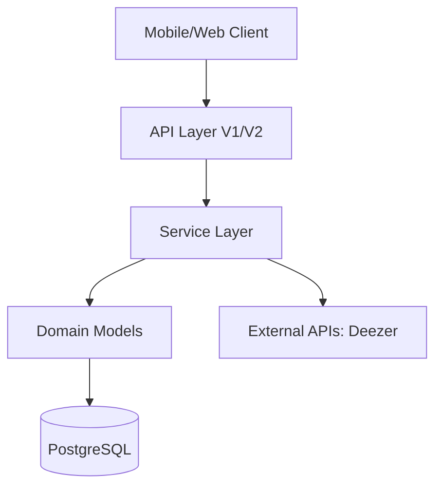

# Listify Backend 🎧

Listify is a professional, scalable social music API built with **Ruby on Rails 8**. It addresses the complexities of social graphs, music metadata synchronization, and real-time feeds with a focus on architectural integrity and mobile-first performance.

---

## 🏗 Architecture Overview

Listify follows a **Service-Oriented Architecture (SOA)** to ensure controllers remain lean and business logic is encapsulated.



### Key Architectural Pillars:
- **Service Objects**: Encapsulated business logic (e.g., `Social::FollowUserService`, `Music::DeezerSyncService`).
- **RESTful Discipline**: Resource-oriented routing for social relationships and data management.
- **Stateless Auth + Refresh**: Short-lived JWTs with secure, rotating Refresh Tokens.
- **Declarative Serialization**: Lightning-fast JSON responses via `Blueprinter`.

---

## 🚀 Version 2 Features

V2 marks the "Redemption Arc" of the project, moving away from simple CRUD to robust system design.

### 1. Data Normalization
Introduced a dedicated `Artist` model. No more "magic strings" for music metadata. All songs and albums are now associated with verified artist records.

### 2. Music Ingestion Pipeline
Integrated with the **Deezer API** for professional-grade music data sync.
- `POST /api/v2/songs/sync`: Triggers a background sync of artists, albums, and songs based on search queries.

### 3. Scalable Feeds
Optimized feed logic using pre-calculated associations and professional serializers, ready for fan-out strategies.

---

## 🔐 Security & Media Safety

- **JWT + Refresh Tokens**: Complete rotation strategy to prevent session hijacking.
- **ActiveStorage Housekeeping**: Strict size (max 5MB) and type (JPEG/PNG/WEBP) validations enforced at the model level to prevent storage abuse.

---

## 📡 API Reference (V2)

| Endpoint | Method | Description |
| :--- | :--- | :--- |
| `/api/v1/auth/login` | POST | Login & receive Access + Refresh tokens |
| `/api/v2/refresh_tokens` | POST | Rotate expired Access Token |
| `/api/v2/relationships` | POST | Follow a user (Resource-based) |
| `/api/v2/feed/explore` | GET | Global discovery feed |
| `/api/v2/songs/sync` | POST | Sync data from Deezer |

---

## 🏁 Getting Started

1. **Prerequisites**: Ruby 3.3+, PostgreSQL.
2. **Setup**:
   ```bash
   bundle install
   rails db:prepare
   ```
3. **Run**:
   ```bash
   rails s
   ```
4. **Test**:
   ```bash
   rails test
   ```

---

## 🛠 Tech Stack
- **Framework**: Rails 8.0
- **Serialization**: Blueprinter
- **Authentication**: Devise + JWT
- **Cloud Storage**: ActiveStorage (libvips)
